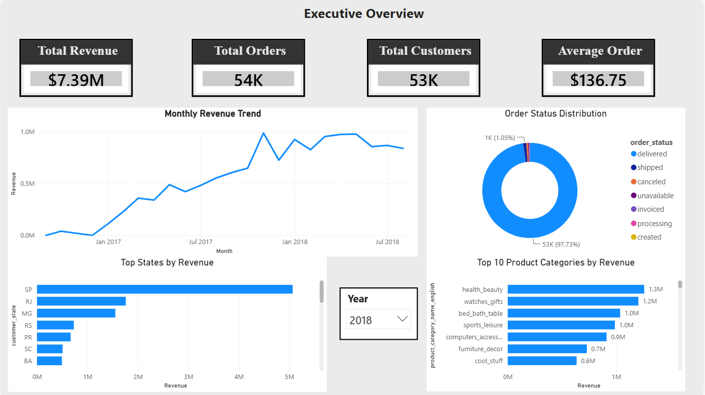
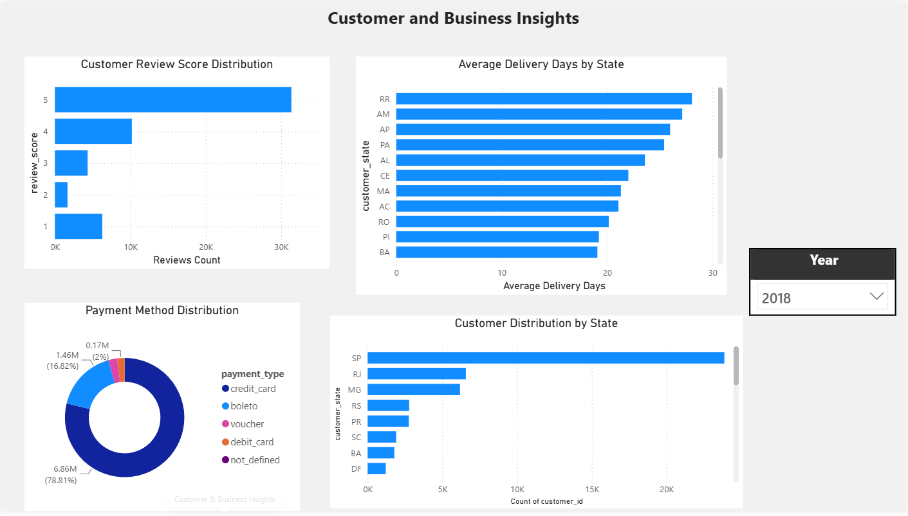

# Olist E-commerce Analytics

An end-to-end data analytics project based on the Brazilian E-Commerce Public Dataset by Olist.

The project covers data discovery, cleaning, exploratory data analysis, PostgreSQL database development, SQL business analysis, data modelling, and interactive Power BI dashboards.

---

## Project Overview

The objective of this project is to analyze an e-commerce marketplace and answer important business questions related to:

- Revenue and order performance
- Product category performance
- Customer distribution
- Customer satisfaction
- Delivery performance
- Payment behaviour
- Regional sales trends

The project demonstrates a complete analytics workflow from raw CSV files to business dashboards.

---

## Dataset

The project uses the **Brazilian E-Commerce Public Dataset by Olist**, available on Kaggle.

The source contains nine related datasets:

- Customers
- Orders
- Order items
- Payments
- Products
- Sellers
- Reviews
- Geolocation
- Product category translations

 **Note:** The raw dataset is not included in this repository due to Kaggle licensing. Download the dataset and place the CSV files inside `data/raw/`.

---

## Technologies Used

- Python
- Pandas
- NumPy
- Matplotlib
- Seaborn
- PostgreSQL
- SQL
- pgAdmin 4
- Power BI
- DAX
- Git and GitHub

---

## Project Workflow

```text
Raw CSV Files
      │
      ▼
Data Discovery and Profiling
      │
      ▼
Data Cleaning with Python
      │
      ▼
Exploratory Data Analysis
      │
      ▼
PostgreSQL Database
      │
      ▼
SQL Business Analysis and Views
      │
      ▼
Power BI Data Model and Dashboards
```

---

## Repository Structure

```text
olist-ecommerce-analytics/
│
├── data/
│   ├── raw/
│   └── processed/
│       ├── category_translation_clean.csv
│       ├── customers_clean.csv
│       ├── geolocation_clean.csv
│       ├── order_items_clean.csv
│       ├── orders_clean.csv
│       ├── payments_clean.csv
│       ├── products_clean.csv
│       ├── reviews_clean.csv
│       └── sellers_clean.csv
│
├── docs/
│   └── .gitkeep
│
├── notebooks/
│   ├── 01_data_discovery.ipynb
│   ├── 02_data_cleaning.ipynb
│   └── 03_exploratory_data_analysis.ipynb
│
├── powerbi/
│   ├── .gitkeep
│   └── olist_ecommerce_dashboard.pbix
│
├── reports/
│   ├── customer_business_insights.png
│   └── executive_overview.png
│
├── sql/
│   ├── 02_create_schema.sql
│   ├── 03_create_tables.sql
│   ├── 04_load_data.md
│   ├── 05_validate_relationships.sql
│   ├── 06_constraints.sql
│   ├── 07_business_analysis.sql
│   └── 08_create_views.sql
│
├── src/
│   └── check_setup.py
│
├── .env.example
├── .gitignore
├── README.md
└── requirements.txt
```

---

## Python Analysis

### 1. Data Discovery

`01_data_discovery.ipynb` examines:

- Dataset dimensions
- Column data types
- Missing values
- Duplicate records
- Unique identifiers
- Descriptive statistics
- Relationships between datasets

### 2. Data Cleaning

`02_data_cleaning.ipynb` performs:

- Duplicate removal
- Data type correction
- Date conversion
- Identifier standardization
- Text cleaning
- Validation of numerical values
- Export of cleaned CSV files to `data/processed/`

### 3. Exploratory Data Analysis

`03_exploratory_data_analysis.ipynb` contains business-focused analysis and visualizations, including:

- Order status distribution
- Monthly order trends
- Product category performance
- Revenue by customer state
- Review score distribution
- Customer and geographic analysis

Each section includes business questions, visualizations, and key findings.

---

## PostgreSQL and SQL

The cleaned datasets were imported into a PostgreSQL database named:

```text
olist_analytics
```

A separate schema named `olist` was created to organize the project tables.

The SQL scripts cover:

- Schema creation
- Table creation
- Data loading instructions
- Primary and foreign key constraints
- Relationship validation
- Business analysis queries
- Reusable analytical views

Examples of business analysis performed in SQL:

- Overall revenue and order metrics
- Monthly sales trends
- Top states by revenue
- Top product categories
- Seller performance
- Payment method analysis
- Review score distribution
- Average delivery time

---

## Power BI Dashboards

The Power BI report connects to PostgreSQL and uses relational tables, SQL views, and DAX measures.

### Executive Overview

The executive page presents:

- Total revenue
- Total orders
- Total customers
- Average order value
- Monthly revenue trend
- Order status distribution
- Top states by revenue
- Top product categories by revenue
- Year-based filtering



### Customer & Business Insights

The second page focuses on customer behaviour and operations:

- Customer review score distribution
- Average delivery days by state
- Payment method distribution
- Customer distribution by state
- Interactive year slicer



---

## Key Insights

- Delivered orders represent approximately 97% of all orders.
- São Paulo is the strongest state by both revenue and customer volume.
- Health and Beauty is one of the highest-revenue product categories.
- Credit cards are the dominant payment method.
- Five-star reviews form the largest share of customer ratings.
- Delivery time varies significantly between Brazilian states.
- Revenue and order activity increased substantially during the main period covered by the dataset.

---

## Running the Project

### 1. Clone the repository

```bash
git clone <your-repository-url>
cd olist-ecommerce-analytics
```

### 2. Create and activate a virtual environment

```bash
python -m venv .venv
```

Windows PowerShell:

```powershell
.venv\Scripts\Activate.ps1
```

### 3. Install dependencies

```bash
pip install -r requirements.txt
```

### 4. Download the dataset

Download the Olist dataset from Kaggle and place the original CSV files inside:

```text
data/raw/
```

### 5. Run the notebooks

Run them in this order:

```text
01_data_discovery.ipynb
02_data_cleaning.ipynb
03_exploratory_data_analysis.ipynb
```

### 6. Set up PostgreSQL

Execute the SQL scripts in numerical order and follow the import instructions in:

```text
sql/04_load_data.md
```

### 7. Open the Power BI report

```text
powerbi/olist_ecommerce_dashboard.pbix
```

Update the PostgreSQL connection settings if required.

---

## Future Improvements

- Customer segmentation
- Cohort and retention analysis
- Delivery delay prediction
- Product recommendation modelling
- Automated data ingestion pipeline
- Additional DAX time-intelligence measures

---

## Author

**Soham Chakraborty**

M.Sc. Computer Science — Data Science and Analytics  
EPITA, Paris